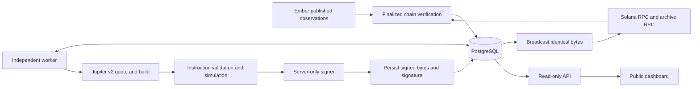

# Architecture

The authoritative state is PostgreSQL. The React application polls a read-only API; it does not schedule settlement. A separate long-running Node process scans source data, reconciles durable intents, and evaluates new commitments. A PostgreSQL lease with a monotonically increasing fence prevents a stale worker from committing database changes. No Redis, browser storage or in-memory ledger is involved.

## Persisted records

`documents` is an append-only, content-addressed store for versioned policy, basket candidate universe, snapshots, raw source observations, provenance, approvals and reconciliation. Migration 008 moves repeated catalogue, selection and readiness polling into `operational_observations`, one replaceable row per type; `current_observation_records` provides a legacy fallback. Funded documents remain immutable. `assets` records decimals and token program. `epochs` pins immutable policy/basket/snapshot references. `incoming_transfers` has instruction-level identities. `funding_receipt_uses` maps each reserved lamport to its original fee receipt and links later direct-cost refunds.

`ledger_events` and `postings` form the accounting journal. Database triggers enforce per-asset balance, immutable historical entries, same-transaction posting insertion and protected epoch identities. `intents`, `attempts`, `chain_receipts`, `entitlements`, `payout_batches` and `batch_items` hold the settlement state. A unique partial index prevents one entitlement appearing in two active batches. Another prevents multiple active signed attempts for one intent.

`jobs` is the durable outbox; intent rows are also recoverable work items, so a lost dispatch cannot lose money. `leases`, `cursors`, `incidents`, `control`, and `operator_audit` support operations. Financial actions are serialized at the treasury while their outcomes are unresolved. Throughput is deliberately limited for a pilot.

## Commit boundaries

1. Under a short fenced database transaction, verify available revenue/reserve and create budgets, immutable references and deterministic intents.
2. Outside the transaction, obtain a route, inspect account ownership/programs and compute/rent, construct allowed instructions, simulate and sign.
3. Under the current fence, persist the approved plan, exact signed bytes, signature, blockhash and last-valid height. A stale worker cannot store an attempt.
4. Inspect the original signature before broadcast or resend. Send only the stored bytes while the blockhash remains valid.
5. Finalization and matching debit/output/recipient evidence allow one atomic accounting transition, credit creation or paid update. Database uniqueness protects replay.

There is no claim of universal exactly-once delivery. A missing RPC result is unresolved. Expired ambiguous attempts stop at `needs_review`; they do not get an automatic replacement. This favors preserved obligations over liveness.

## Integration boundaries

The Solana adapter implements real checked token transfers, idempotent ATA creation, simulation, signatures, finality verification and checked burn. Test swaps are explicit native-SOL/fixture-token exchanges with a test market signer. The Jupiter adapter uses current v2 endpoints but only accepts a conservative decoded direct-route subset. Unsupported route instructions fail closed.

An observed market row is not a verified investment candidate. The pipeline checks known Ember configs and on-chain DBC identities with the Meteora SDK, mint authorities/programs and full holder census. A reviewed complete metrics feed supplies currently unavailable pool-liquidity and comparable capitalization evidence. It must match the discovered mint universe hash and be fresh; missing entries block commitments. Its evidence and ranking basis are retained in the basket.

## Modes and deployment

Each database has an immutable mode marker. Reusing a demo database in live mode fails. Demo uses database-backed synthetic chain receipts, never a Solana broadcaster. File-based signing exists only for test mode; actual RPC genesis is checked before any test transaction. Live requires a remote signer and separately configured approval, assets, programs, wallets and limits.

Host `dist/web` as static content and proxy `/api` to the Node API. Keep `/operator` on a private interface. Run the worker independently on a persistent Node host with access to PostgreSQL, RPC and the signer. `compose.yaml` is a local reference deployment and was not run here. The remote signer must independently enforce its own treasury/budget policy; it accepts a base64 message and returns a 64-byte signature, never a secret key.

The service is custodial with respect to the reward treasury. Operators and infrastructure are trusted. This implementation is neither trustless nor an audited security boundary against a malicious treasury operator.

## EMBER10 hosted discovery boundary

The serverless dashboard has a separate read-only observation path: Ember catalogue/config responses ? bounded schema validation ? mint normalization and source-defined suspect exclusions ? numeric reported-USD ranking ? public page projection. Cached market observations are not a ledger. Unknown provenance, circulating supply and route checks do not become eligible assets. The immutable funded basket continues to belong to a PostgreSQL epoch, independently of any moving market ranking.

Normal production routing does not import the archived demo. The old demonstration files remain available only to explicit local demonstration/test tooling and historical review.
